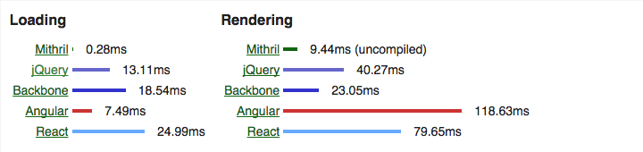

% Mithril and Webpack
% Michael Hellein
% [Doc](https://github.dev.dealertrack.com/ddcmichaelhellein/presentations/blob/master/source/mithril-webpack.md) / [Presentation](https://github.dev.dealertrack.com/pages/ddcmichaelhellein/presentations/mithril-webpack.html#/)


# Why are we here?


## Some Context

We want to create modular and performant client-side applications, with a maximum of "just plain JavaScript" and a minimum of boilerplate.

## Webpack

Webpack is an opinionated module bundler for front-end assets. Like Browserify, it lets us treat local files as modules, concatenating intelligently.

```js
var something = require('./something.js');
```

## Mithril

Mithril is a lightweight client-side MVC framework. Like React, it has one-way data flows and virtual DOM diffing.

```js
var m = require('mithril');
m.mount(document.body, { 
  view: function() { return m('p', 'Hello, world.') } 
});
```

## They Taste Great Together

Mithril does not have a module registry, because JavaScript already does: **require/import**. Webpack provides that until we're able to adopt ES2015 and HTTP/2.0.


# Webpack

## The Concept


## Ok, but we have a lot of ways to do this!

[Grunt](http://gruntjs.com/) / [Gulp](http://gulpjs.com/) / [Brunch](http://brunch.io/) / [RequireJS](http://requirejs.org/) / [Browserify](http://browserify.org/)

## We're Not Unique

> [If you need a cabin, why start
with a mere pile of logs?](https://medium.com/@housecor/browserify-vs-webpack-b3d7ca08a0a9) - Cory House

Convention > Configuration.

## ♥ tools that do the right thing

Webpack is like the best of Brunch (lightweight configuration) plus the best of Browserify (fluent dependency resolution).

## Let's get started

webpack.config.js
```js
module.exports = {
    entry: "./index",
    output: {
        path: __dirname,
        filename: "[name].bundle.js"
    }
};
```

> > git:c91201c

## Install

```bash
npm install -g webpack webpack-dev-server
```

## Run it

```bash
webpack-dev-server
```

The dev server is one of the nice things webpack gives us - a server running on <http://localhost:8080/> that rebuilds bundles and live-reloads connected browsers.

## Terminology

**bundle**
: destination asset

**chunk**
: the content of the bundle

**loader**
: plugin responsible for processing files based on match patterns

> > Loaders are like what React calls "transforms".

## A tiny example

index.js
```js
require('./a');
```

a.js
```js
console.log('a here');
```

> > git:efda626

---

index.html
```html
<!doctype html>
<body>
    <script type="text/javascript" src="main.bundle.js"></script>
</body>
```

---

main.bundle.js
```js
/******/ (function(modules) { // webpackBootstrap
... ~243B min ...
/******/ ([
/* 0 */
/***/ function(module, exports, __webpack_require__) {
    __webpack_require__(1);
/***/ },
/* 1 */
/***/ function(module, exports) {
    console.log('a here');
/***/ }
/******/ ]);
```

## Require a node module

```bash
npm install immutable
```

```js
var Immutable = require('immutable');
```

Yep, just like Browserify...

> > git:25e9d40


## Let's use a loader

```bash
npm install raw-loader style-loader
```

webpack.config.js
```js
module.exports = {
    entry: "./index",
    output: {
        path: __dirname,
        filename: "[name].bundle.js"
    }
};
```

> > git:83dbf0d


---

Now when we `require('./something.css');` we'll get those styles inlined into our JavaScript bundle.

---

### Loaders work with node modules too

```bash
npm install purecss
```

```js
require('purecss');
```

Because purecss has a CSS file as `main` in its `package.json`.

> > git:818ce8b


## Commons Chunk

added to webpack.config.js:
```js
var webpack = require('webpack');
...
   plugins: [new webpack.optimize.CommonsChunkPlugin('common.js');]
```

added to index.html:
```
  <script src="common.js"></script>
```

## Async bundle loading

```js
if (window.location.pathname === '/feed') {
  // this syntax is weird but it works
  require.ensure([], function() { 
    // this module is now synchronously available.
    require('./feed').show(); 
  });
}
```

> From Pete Hunt's [webpack-howto](https://github.com/petehunt/webpack-howto).

## Webpack helps us be modular


# Background Concepts

## Functional Programming

Functions don't have side effects. They return new values, leaving passed values unchanged.

## Immutable Data

Helps us be functional. Operations on immutable data structures don't have side effects, they return new structures.

## Virtual DOM

A data structure that mirrors the state of the actual DOM, so a renderer can quickly know what needs to be redrawn.

## One-way Data Flow

Don't listen for changes to values from the UI. Let the UI make updates to the Virtual DOM, which will be used to redraw the UI.

## Efficient Redraws

Updating the DOM is expensive! Batch operations that would change the DOM, at minimum within one animation frame.

## The Paradigm

React, Mithril, Om, and others use these concepts to make snappy applications that are easy to reason around.


# Mithril

## Let's Get Started

```bash
npm install mithril
```

index.js:
```js
var m = require('mithril');
```

> > git:b3ec643

## MVC

Mithril is an MVC, but its parts are just POJOs.

---

### View

```js
m.mount(document.body, {
  view: function() {
    return m('p', 'Hello.');
  }
});
```

**m.mount()** attaches a Mithril component to the DOM. **m()** is the Virtual DOM builder.

> > git:91b0aee
> > m() is very close to React.createElement(). Some people even like to alias [React.createElement to h](http://ludovf.net/reactbook/blog/reactjs-without-jsx-part2.html).


---

### Controller

```js
m.mount(document.body, {
  controller: function() {
    return {
      num: 1
    }
  },
  view: function(controller) {
    return m('p', ['Hello.', controller.num]);
  }
});
```

> > git:44d59c7

---

### Model

```js

var Nums = {
  awesomeNum: 1
};

m.mount(document.body, {
  controller: function() {
    return {
      num: Nums.awesomeNum
    }
  },
  view: function(controller) {
    return m('p', ['Hello.', controller.num]);
  }
});
```

> > git:c9c8007

## Data Changes

```js
  controller: function() {
    return {
      num: function() {
        return Nums.awesomeNum
      },
      add: function() {
        Nums.awesomeNum = Nums.awesomeNum + 1;
      }
    }
  },
  view: function(controller) {
    return m('p', {onclick: controller.add}, 
      ['Hello.', controller.num()]);
  }
```

> > git:74f400e

## m.prop()

```js

var Nums = {
  awesomeNum: m.prop(1)
};

m.mount(document.body, {
  controller: function() {
    return {
      num: Nums.awesomeNum,
      add: function() {
        Nums.awesomeNum(Nums.awesomeNum() + 1);
      }
    }
  },
  view: function(controller) {
    return m('p', {onclick: controller.add}, 
      ['Hello.', controller.num()]);
  }
});
```

> > git:2326c61

## Changes from outside Mithril

```js
setInterval(function(){
  Nums.awesomeNum(Nums.awesomeNum() - 1);
}, 1000);
```

That only updates when we click the p. What gives?

> > git:b9b636f

## computation

Mithril needs to know something has changed. Mithril wraps Virtual DOM events in **m.startComputation()** and **m.endComputation()** to manage an internal counter.

```js
setInterval(function(){
  m.startComputation();
  Nums.awesomeNum(Nums.awesomeNum() - 1);
  m.endComputation();
}, 1000);
```

When the counter is 0, a redraw happens.

> > git:db560e8

## Application Framework Bits

Mithril doesn't come with many bells and whistles. There are a few things that are pretty usefult.

---

### m.request()

Manages HTTP requests (wrapped in **m.startComputation()** and **m.endComputation()**).

```js
m.mount(document.body, {
  controller: function() {
    return {
      posts: m.request({method: "GET", url: "http://jsonplaceholder.typicode.com/posts"})
    }
  },
  view: function(controller) {
    return m('ul', controller.posts().map(function(post){
      return m('li', [m('h3', post.title), m('p', post.body)]);
    }));
  }
});
```

> > git:7bf3dd7

---

### m.route()

a.js:
```js
module.exports = {
  view: function() { return m('p.awesome', 'Component A.') }
}
```

index.js:
```js
m.route(document.body, '/a-url', {
  '/a-url': require('./a'),
  '/b-url': require('./b')
});
```

> > git:2a06653

## Pre-compilation

Templates can be even faster, if they're [pre-compiled](http://lhorie.github.io/mithril/optimizing-performance.html#compiling-templates) as a build step.

```js
var view = function() {
    return m("a", {href: "http://google.com"}, "test");
}
```
->
```js
var view = function() {
    return {tag: "a", attrs: {href: "http://google.com"}, children: "test"};
}
```

## Server Rendering

The [mithril-node-render](https://github.com/StephanHoyer/mithril-node-render) project lets us render Mithril components from Node.

```bash
npm install mithril-node-render
```

```js
var m = require('mithril');
var render = require('mithril-node-render');

console.log(render(require('./a')));
```

```bash
$ node node.js 
<p class="awesome">Component A.</p>
```

> > git:b4e22a4
> > Access to http resources via m.request() should be stubbed in webpack to use Node.

## Mithril is tiny

### 7.3K min and gzip

Size (still) matters!


## Mithril is fast



[Benchmarks](http://lhorie.github.io/mithril/benchmarks.html)

## Mithril keeps us close to plain JavaScript

And that's a good thing!

# Next Steps

## Immutable.js

## Server-side data access

# References

##

- <http://webpack.github.io/docs/>
- <http://lhorie.github.io/mithril/index.html>
- [Getting Started with Webpack notes](https://github.dev.dealertrack.com/gist/ddcmichaelhellein/6ddae5176cc7e1734473)
- [Getting Started with Mithril notes](https://github.dev.dealertrack.com/gist/ddcmichaelhellein/ded16f360126a5bebc6f)


# Thanks!
